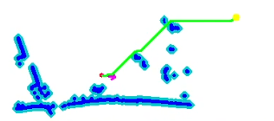
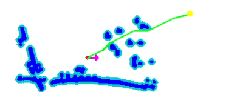

# **基于ROS的自主水面无人船系统研究与仿真**

路径规划使用A_star和改进A_star，运动控制使用长短期记忆网络（LSTM）

1.环境：

ROS2 humble；pytorch 2.6.0+cu124；kubuntu 22.04；

2.在vrx_gz\models中找到huan、shizi、zhuzi、fangkuai四个文件夹，修改障碍物图片位置

3.编译代码：

```colcon build```

4.运行世界环境：

```ros2 launch vrx_gz competition.launch.py world:=wayfinding_task2 sim_mode:=full```

5.运行A*算法或改进A*算法：

```python3 A_star.py```

或

```python3 improved_A_star.py  ```

A*:




改进A:



 
